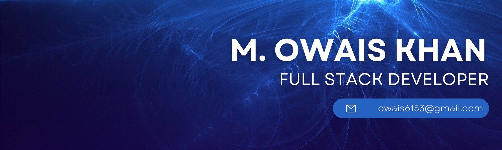

<h1>Full Stack Maestro</h1>

Welcome to my digital playground!💡💻 I'm <b>Owais Khan</b>, a passionate software engineer having over 5 years in development. Has much experience in creating logical and innovative solutions to complex problems. Has a keen interest in technology and user experience. 

<h2>🛠️ My Skills:</h2>
<ul>
<li><h3>Front-End:</h3>

</li>
<li><h3>Back-End:</h3>

  

</li>
<li><h3>CMS:</h3>

</li>
<li><h3>Database:</h3>

  

</li>
<li><h3>Devops & Version Controlling:</h3>

</li>
</ul>
<h2>⚡️ A Few Quick Facts</h2>
<ul>
<li>🔭 I’m currently working for <a href="https://github.com/designocracy">Designocracy</a> & <a href="https://github.com/Epic-Jam">Epic Jam</a>.</li>
<li>👨‍💻 I’m currently working on mostly MERN, Laravel, and Wordpress backend development projects.</li>
<li>🧐 Learning about <strong>Serverless Architectures</strong>, <strong>distributed systems</strong>, and a bit of <strong>Blockchain & AI (Artificial Intelligence)</strong>.</li>
<li>👨‍💻 Most of my projects are available on <a href="https://github.com/owais6153">Github</a>.</li>
</ul>
<h2>📬 Get in Touch:</h2>

